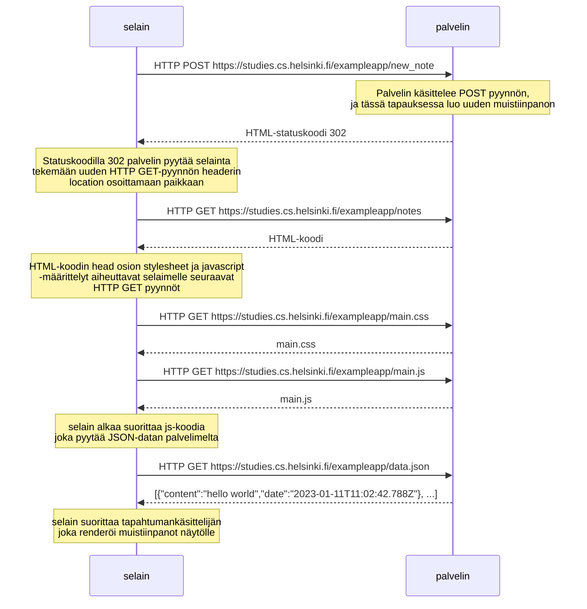

```mermaid
sequenceDiagram;
  selain->>palvelin: HTTP POST https://studies.cs.helsinki.fi/exampleapp/new_note
  note over palvelin: Palvelin käsittelee POST pyynnön, <br> ja tässä tapauksessa luo uuden muistiinpanon
  palvelin-->>selain: HTML-statuskoodi 302
  note over selain: Statuskoodilla 302 palvelin pyytää selainta <br>tekemään uuden HTTP GET-pyynnön headerin <br>location osoittamaan paikkaan

  selain->>palvelin: HTTP GET https://studies.cs.helsinki.fi/exampleapp/notes
  palvelin-->>selain: HTML-koodi

  note over selain: HTML-koodin head osion stylesheet ja javascript <br>-määrittelyt aiheuttavat selaimelle seuraavat <br> HTTP GET pyynnöt

  selain->>palvelin: HTTP GET https://studies.cs.helsinki.fi/exampleapp/main.css
  palvelin-->>selain: main.css
  selain->>palvelin: HTTP GET https://studies.cs.helsinki.fi/exampleapp/main.js
  palvelin-->>selain: main.js

  note over selain: selain alkaa suorittaa js-koodia <br>joka pyytää JSON-datan palvelimelta

  selain->>palvelin: HTTP GET https://studies.cs.helsinki.fi/exampleapp/data.json
  palvelin-->>selain: [{"content":"hello world","date":"2023-01-11T11:02:42.788Z"}, ...]

  note over selain: selain suorittaa tapahtumankäsittelijän <br>joka renderöi muistiinpanot näytölle
```
