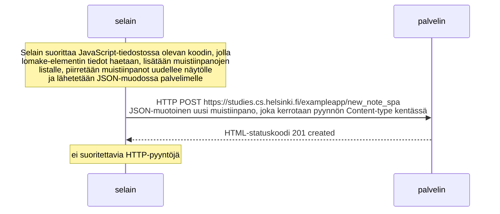

```mermaid
sequenceDiagram;
  note over selain: Selain suorittaa JavaScript-tiedostossa olevan koodin, jolla <br> lomake-elementin tiedot haetaan, lisätään muistiinpanojen <br> listalle, piirretään muistiinpanot uudellee näytölle <br> ja lähetetään JSON-muodossa palvelimelle
  selain->>palvelin: HTTP POST https://studies.cs.helsinki.fi/exampleapp/new_note_spa <br> JSON-muotoinen uusi muistiinpano, joka kerrotaan pyynnön Content-type kentässä
  palvelin-->>selain: HTML-statuskoodi 201 created
  note over selain: ei suoritettavia HTTP-pyyntöjä
```
